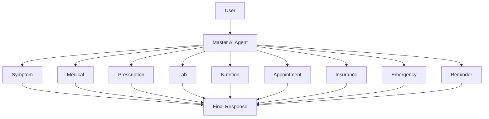
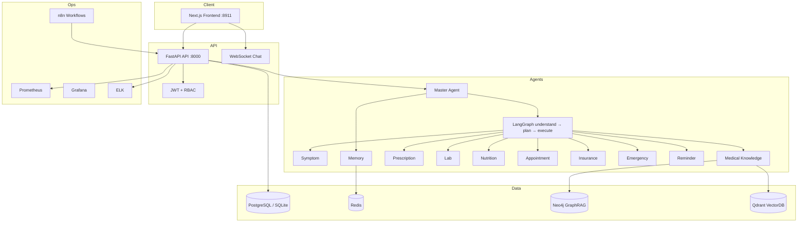
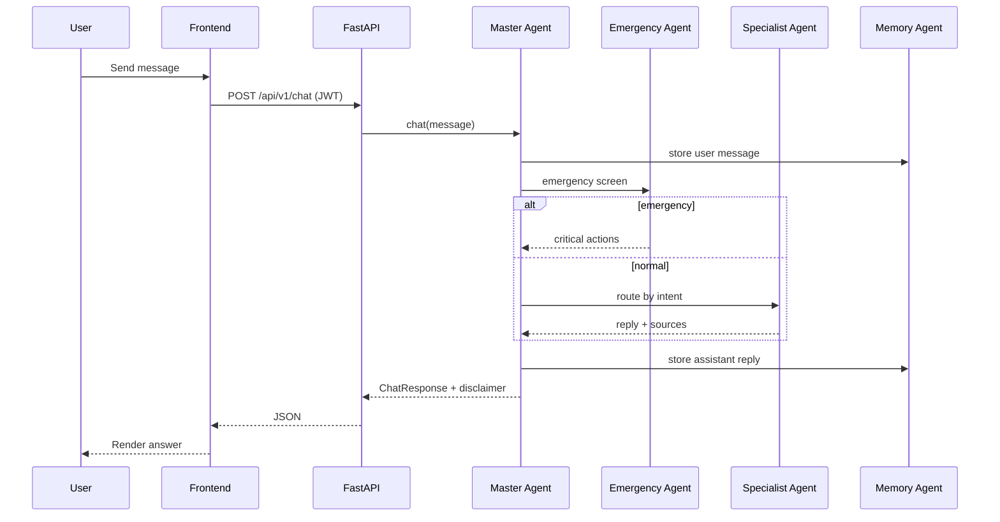
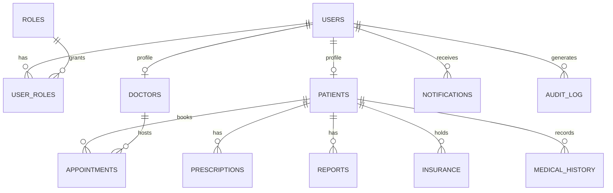

# Architecture

## Agent Architecture

```text
                    User
                      │
              Master AI Agent
      ┌─────────┼──────────┐
 Symptom   Medical   Prescription
 Lab        Nutrition  Appointment
 Insurance  Emergency  Reminder
                      │
              Final Response
```



## System Architecture



## Sequence: Chat



## ER Diagram


